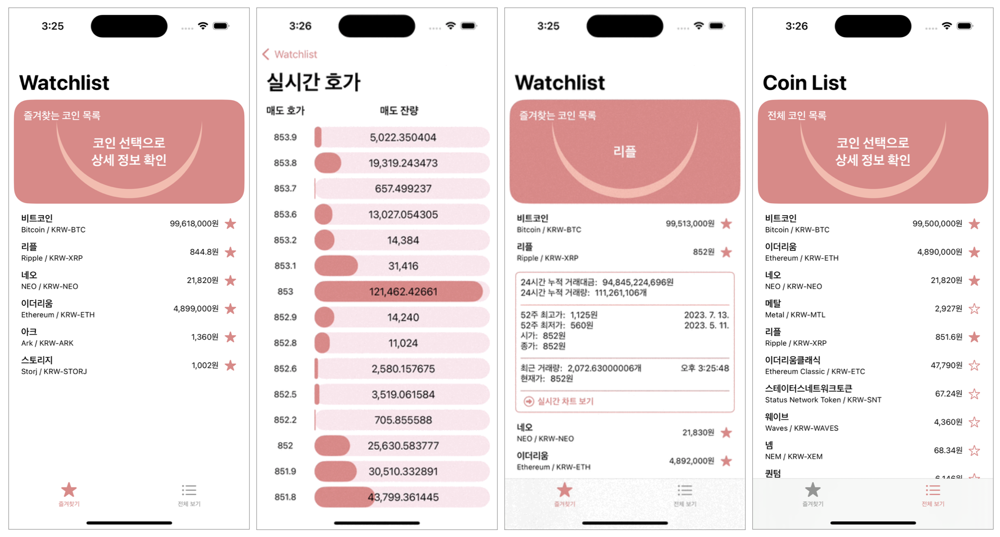

## CoinPocket - 관심가는 코인 실시간 트래킹



## 앱 소개
 * 거래되는 코인 목록 조회 및 즐겨찾기
 * 코인의 현재가, 거래량 등의 실시간 변동사항 조회 및 실시간 호가 차트 제공
<br/>


## 주요 기능
 * ViewModifier를 통한 Custom View 관리
 * property wrapper를 활용하여 UserDefault 데이터 관리
 * 불필요한 뷰 렌더링 최소화를 위한 StateObject로의 데이터 처리
 <br/>

## 개발 기간
 * 2024.04.01.~ 2024.04.06. (6일)
<br/>


## 개발환경
  * Xcode 15.2
  * Supported Destinations : iPhone
  * Minimum Deployments : 17.0
  * Orientation : Portrait
<br/>


## 사용기술 및 라이브러리
 * SwiftUI, MVVM, Combine, UserDefaults
 * URLSession, RestAPI, WebSocket
 <br/>
 
## 트러블 슈팅     
 ### 1. 전체 코인 목록의 현재가를 불러올 때 과도한 API 콜 발생
   * 배열에 전체 코인의 현재가를 저장하려다보니 뷰에 표시되지 않는 항목에 대해서도 API 요청이 필요하게 되어 불필요한 트래픽 발생
   * 각각의 리스트 항목에 대한 view를 별도 구조체로 만들어 해당 구조체에서 네트워크 요청을 시도하고 LazyVStack으로 필요할 때 로드되도록 변경
     ```swift
     struct ListView: View {
       var body: some View {
          VStack {
              Button(action: {
                  ...
              }, label: {
                  ...
              })
              .foregroundStyle(.black)
              .onAppear {
                  viewModel.getPrice(market)
              }
          }
      }

     struct MainView: View {
       var body: some View {
         LazyVStack {
           ForEach(viewModel.market, id: \.hashValue) { item in
             listView(korean: item.korean, english: item.english, market: item.market, coinName: $coinName)
           }
        }
       }
     }
     ```
   
 ### 2. WebSocket 통신 시 응답값에 따른 뷰 변동 이슈
   * 코인의 상세 정보 및 그래프를 표현할 때 WebSocket 응답값이 실시간으로 반영되어야 하는데 변동되지 않는 이슈 발생
   * 지속적으로 들어오는 응답값을 한번만 처리하여 발생된 이슈로 추측, combine을 활용하여 방출되는 매 이벤트에 반응하도록 설계
     ```swift
      CoinOrderBookWebSocketManager.shared.response
            .receive(on: DispatchQueue.main)
            .sink { orderBook in
                let result = orderBook.units
                let ask = result.map { OrderBookItem(price: $0.askPrice, size: $0.askSize) }.sorted(by: { $0.price > $1.price })
                let bid = result.map { OrderBookItem(price: $0.bidSize, size: $0.bidSize) }.sorted(by: { $0.price > $1.price} )
                
                self.askOrderBook = ask
                self.bidOrderBook = bid
            }
            .store(in: &cancellable)
     ```

<br/>

## 회고
 * 전체 코인 리스트의 경우 LazyVStack 및 list 뷰를 별도로 구현했음에도 upbit에서 제한한 호출 수를 초과하여 오류가 리턴되는 케이스가 발생,
   이를 해결하고자 URLSession의 캐시 정책을 활용하려 하였으나 추가 학습이 필요하다고 판단하여 추후 구현해보고자 함
 * 또한 사용자가 즐겨찾기한 코인 목록의 정보를 위젯으로 제공하는 기능도 구현하고 싶어 학습 후 구현 예정
